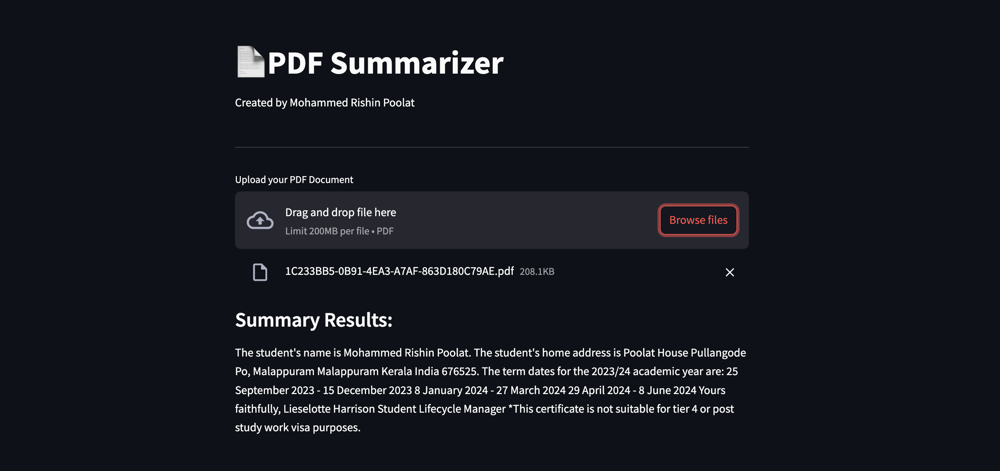

# PDF Summarizer

## Description

The system is built with the aim of summarising a PDF file uploaded by the user. This system is created using Streamlit, LangChain, and HugggingFace frameworks.

## Preview

To see a preview of this system, check out the preview below.



## How to Use

In the lines of the program code below, change `YOUR_OPENAI_API_KEY` to match your HUGGINGFACEHUB_API_TOKEN. This line of code can be found in the `.env.example` file.

```bash
HUGGINGFACEHUB_API_TOKEN=YOUR_OPENAI_API_KEY
```
